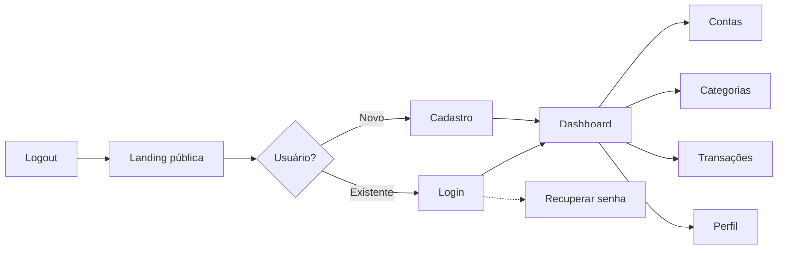

# PRD — Finanpy

## 1. Visão geral
Finanpy é um sistema web de gestão de finanças pessoais, simples e enxuto, em Django full‑stack com Django Template Language e TailwindCSS. Foco em usabilidade, visual moderno escuro com gradientes e operações essenciais: contas, categorias e transações.

## 2. Sobre o produto
Organiza entradas e saídas, oferece visão rápida do saldo, e simplifica o controle financeiro diário com UX clara e consistente.

## 3. Propósito
Ajudar pessoas a entender e planejar suas finanças, reduzindo esforço manual e aumentando disciplina financeira.

## 4. Público alvo
Usuários individuais que desejam controlar gastos/receitas sem complexidade.

## 5. Objetivos
- Onboarding em minutos; curva de aprendizado baixa.
- Dash visível com saldo e totais por período.
- CRUDs rápidos com atalhos e filtros básicos.

## 6. Requisitos funcionais
- RF‑01 Landing pública com chamadas “Cadastre‑se” e “Entrar”.
- RF‑02 Autenticação nativa Django via e‑mail/senha; recuperação de senha.
- RF‑03 Dashboard com saldo atual, receitas x despesas, lista recente.
- RF‑04 Contas: criar/editar/arquivar; saldo inicial.
- RF‑05 Categorias: receita/depesa com cor/ícone opcional.
- RF‑06 Transações: conta, categoria, valor, tipo (R/D), data, descrição.
- RF‑07 Filtros por período, conta e categoria; busca por descrição.
- RF‑08 Perfil do usuário (nome, preferências básicas).
- RF‑09 Todas as telas com o mesmo layout (design system).

## 7. Fluxos de UX (Mermaid)


## 8. Requisitos não‑funcionais
- Simplicidade (sem over engineering), sem Docker e sem testes iniciais.
- Desempenho: páginas < 200ms no servidor em cenários típicos.
- Segurança: CSRF, senhas hash, sessões seguras.
- Acessibilidade: contraste adequado e navegação por teclado.
- Banco: SQLite padrão.

## 9. Arquitetura técnica
Django 5, apps: `users`, `profiles`, `accounts`, `categories`, `transactions`, `core`. Views baseadas em classes. Signals por app em `signals.py`. Templates DTL com layout compartilhado. Tailwind via CDN.

## 10. Stack
Python 3.x, Django 5.x, SQLite, TailwindCSS (CDN), HTML DTL.

## 11. Estrutura de dados (Mermaid)
```mermaid
erDiagram
  USER ||--o{ PROFILE : has
  USER ||--o{ ACCOUNT : owns
  USER ||--o{ CATEGORY : defines
  ACCOUNT ||--o{ TRANSACTION : records
  CATEGORY ||--o{ TRANSACTION : classifies

  USER {
    bigint id
    string email
    string password
    datetime created_at
    datetime updated_at
  }
  PROFILE {
    bigint id
    bigint user_id
    string full_name
    datetime created_at
    datetime updated_at
  }
  ACCOUNT {
    bigint id
    bigint user_id
    string name
    decimal opening_balance
    boolean archived
    datetime created_at
    datetime updated_at
  }
  CATEGORY {
    bigint id
    bigint user_id
    string name
    string type  // income|expense
    string color
    datetime created_at
    datetime updated_at
  }
  TRANSACTION {
    bigint id
    bigint account_id
    bigint category_id
    decimal amount
    string kind  // income|expense
    date date
    string description
    datetime created_at
    datetime updated_at
  }
```

## 12. Design system
- Cores: fundo `slate-900`, texto `slate-100`, gradiente primário `from-indigo-500 via-purple-500 to-sky-500`.
- Botões: `inline-flex items-center px-4 py-2 rounded-md bg-gradient-to-r from-indigo-500 to-sky-500 text-white hover:opacity-90 focus:outline-none focus:ring-2 focus:ring-indigo-400`.
- Inputs: `bg-slate-800 border border-slate-700 rounded-md px-3 py-2 text-slate-100 placeholder-slate-400 focus:ring-2 focus:ring-indigo-400 focus:border-transparent`.
- Cards/containers: `bg-slate-900/60 backdrop-blur border border-slate-800 rounded-xl shadow`.
- Grids: `grid grid-cols-1 md:grid-cols-2 xl:grid-cols-4 gap-4`.
- Menus/navbar: `bg-slate-950/70 border-b border-slate-800`.
- Fonte: `Inter`, fallback `ui-sans-serif, system-ui`.
- Exemplo DTL:
```html
<nav class="bg-slate-950/70 border-b border-slate-800">
  <div class="container mx-auto px-4 py-3 flex justify-between">
    <a href="/" class="text-slate-100 font-semibold">Finanpy</a>
    
      <a class="btn" href="">Sair</a>
    
      <a class="btn" href="">Entrar</a>
    
  </div>
  </nav>
```

## 13. User stories (Épico: Gestão Financeira)
- US‑01: Como visitante, quero criar conta para acessar o sistema.
- US‑02: Como usuário, quero entrar via e‑mail/senha.
- US‑03: Como usuário, quero ver o dashboard com saldo e totais.
- US‑04: Como usuário, quero gerenciar contas.
- US‑05: Como usuário, quero gerenciar categorias.
- US‑06: Como usuário, quero registrar transações rapidamente.
- US‑07: Como usuário, quero filtrar transações por período/conta/categoria.
- US‑08: Como usuário, quero editar perfil básico.

## 14. Critérios de aceite (exemplos)
- Login: aceita e‑mail válido e senha; erros exibidos; redireciona ao dashboard.
- Transação: campos obrigatórios validados; atualização de saldo da conta refletida no dashboard.

## 15. Métricas de sucesso
- Tempo até primeira transação < 5 min.
- Retenção D7 > 25%.
- Erros 5xx < 0.5%.

## 16. KPIs
- Produto: MAU, taxa de ativação (cadastro→1ª transação).
- Usuário: frequência de registro/semana, ticket médio por transação.

## 17. Riscos e mitigações
- Adoção baixa: onboarding simples e CTA claros.
- Dados inconsistentes: validações e constraints simples.
- Segurança: uso de padrões Django (CSRF, auth).


